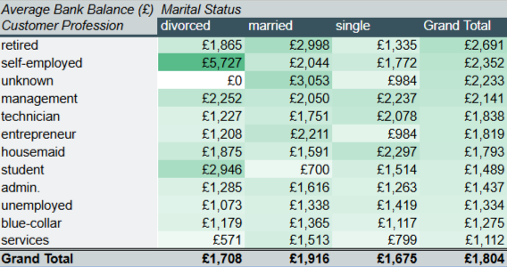

# 🏦 Lab Report: Bank Marketing Analysis

> **Quick Link:** [📊 View the Full Spreadsheet Analysis](./Bank_Marketing.xlsx)

## 🎯 1. Project Overview
The objective of this project was to analyse a large-scale marketing dataset (45,211 records) to identify patterns in customer demographics and their response to a term deposit campaign. The goal was to provide data-driven insights to improve future telemarketing efficiency and conversion rates.

## 🧹 2. Data Exploration and Preparation
The dataset required significant validation and interrogation before analysis could begin:
* **Data Cleaning**: Categorical fields such as 'job', 'marital status', and 'education' were standardised to ensure consistency. 
* **Outlier Identification**: I utilised the **Range** and **Standard Deviation** to identify extreme values that could skew the analysis.
    * **Age**: The range of 77 years (min 18, max 95) showed a broad demographic.
    * **Balance**: The maximum balance of £102,127 was identified as a natural outlier (high-net-worth individual).
    * **Duration**: Calls lasting over 3,000 seconds were flagged as anomalies that skewed the mean call duration.

## 🔢 3. Statistical Methodology
I applied various descriptive statistics to summarise the 45,211 records:
* **Central Tendency**: 
    * **Mean Age**: 40.9 years.
    * **Mean Salary**: £57,006.
    * **Mean Balance**: £1,362.
* **Tools Applied**: 
    * **Pivot Tables**: Used to segment campaign success ('y') against job types and education levels.
    * **Standard Deviation**: Employed to measure the variance in customer account balances (£3,044.73).

## 📊 4. Key Findings
* **Subscription Success:** Out of 45,211 contacts, 5,289 (11.7%) successfully subscribed to the term deposit.
* **The "Balance" Effect:** Customers who subscribed had a higher mean bank balance (£1,804) compared to those who did not (£1,303).
* **Target Demographics:** Management and retired individuals showed a higher propensity to subscribe compared to blue-collar workers.

### 📊 Identifying High-Net-Worth Demographics (The Conversion Heatmap)

While basic conversion rates tell us *how many* customers subscribed, they don't tell us *who* brings the most capital into the bank. To solve this, I developed a **High-Net-Worth Conversion Heatmap**.

This Pivot Table filters strictly for successful conversions (`y = yes`) and calculates the **Average Bank Balance** of those customers, cross-referencing their **Profession** with their **Marital Status**. 

 

**Key Configuration:**
* **Data Segmentation:** Filtered to isolate positive outcomes.
* **Weighted Analysis:** Sorted descending by the 'Grand Total' to account for population size, prioritizing overall demographic wealth over isolated spikes.
* **Visual Encoding:** Applied a conditional formatting colour scale (Green-to-White) to draw immediate attention to the most lucrative micro-segments.

**Strategic Insights:**
1. **The Volume Target (Married Retirees):** The 'Grand Total' sorting reveals that 'Retired' customers are the most consistently lucrative demographic overall. This is heavily driven by married retirees, who maintain a strong average balance of nearly £3,000.
2. **The Premium Niche (Divorced Self-Employed):** The heatmap instantly flags a hidden high-value segment. While 'Self-Employed' ranks second overall, 'Divorced Self-Employed' customers are the single wealthiest niche, bringing in nearly £6,000 on average.

## 💡 5. Strategic Recommendations
* **Focus on High-Yield Segments**: Future marketing efforts should be prioritised toward customers with balances above the £1,362 mean.
* **Call Optimisation**: Since "Duration" is a high-variance metric, training should focus on the **Median** call length (180 seconds) as a benchmark for representative call efficiency.